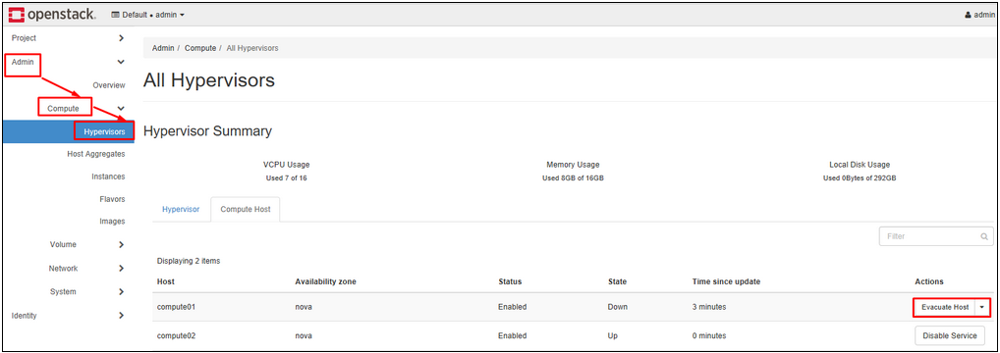
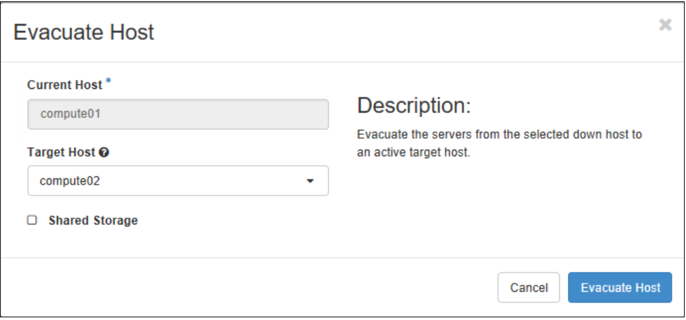
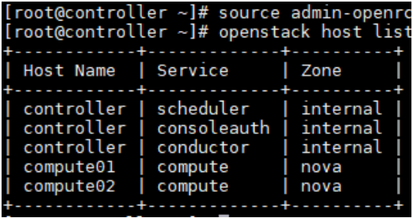
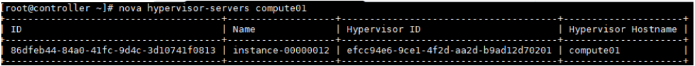
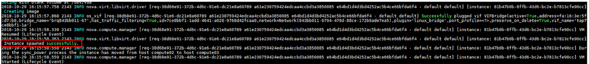

# Kỹ thuật Evacute VM 

Kỹ thuật Evacuate máy ảo là kỹ thuật cứu máy ảo trong trường hợp node Compute bị sự cố về phần cứng và không thể start lên được. 

Các điều kiện để thực hiện việc evacuate máy ảo là : 

- Node Compute gặp sự cố đảm bảo tình trạng down. 
- Các node Compute sử dụng chung share storage (như Ceph).

LƯU Ý: Nếu trong quá trình thực hiện evacuate node Compute start lên các máy ảo đang thực hiện evacuate sẽ gặp lỗi.

## 1.Thực hiện trên giao diện Horizon

Khi thực hiện trên Horizon, OpenStack sẽ thực hiện evacuate toàn bộ vm đang chứa trong compute.

Sau khi đã kiểm tra node Compute thực sự down. Kiểm tra trên Horizon OpenStack. 

Tại project admin, mục Admin => Compute => Hypervisor => Compute Host. Với các node Compute đã down sẽ có nút Evacuate Host như hình dưới. 



Thực hiện chọn host compute đích. (Compute máy ảo sẽ move sang).



Sau khi thực hiện xong, login vào Console máy ảo để kiểm tra.

## 2.Thực hiện bằng Command line
Login vào máy Controller. Thực hiện source file environment của admin.
```sh
source admin-openrc
```

List các host compute đang có trong hệ thống :
```sh 
openstack host list
```


List các server đang có trong node compute01. 
```sh 
nova hypervisor-servers compute01
```


**Trường hợp 1 :** Evacuate máy ảo chỉ định : 
```sh 
nova evacuate $vm_id $destination_compute
```

Trong đó : 

- $vm_id : ID của vm được lấy ở trên
- $destination_compute : Compute đích được evacuate

Kiểm tra lại log tại phía Compute đích. VM được evacuate sẽ được rebuild lại với cấu hình cũ. Kiểm tra tại file log của Compute đích với câu lệnh : 
```sh 
tailf /var/log/nova/nova-compute.log
```

Nếu như log có dòng thông báo “ Instance spawned successfully” 


**Trường hợp 2 :** Evacuate toàn bộ máy ảo
```sh 
nova host-evacuate --target $destination_compute $source_compute
```

Trong đó : 

- $destination_compute : Compute đích được evacuate (compute còn sống)
- $source_compute : Compute bị lỗi.

Thực hiện kiểm tra máy ảo đã được evacuate trên Horizon.
